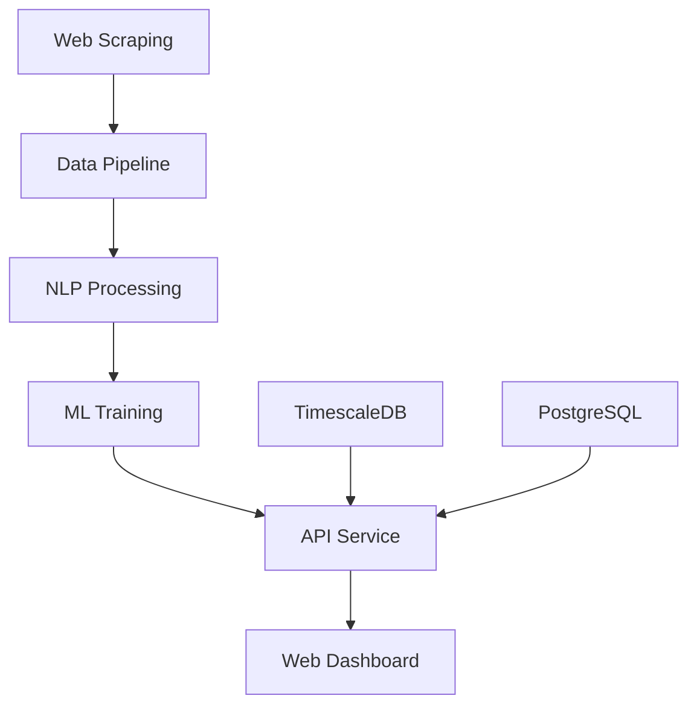

# 🚀 TrendCatcher - İş Trendleri ve Maaş Tahmincisi

TrendCatcher, iş ilanlarını analiz eden ve maaş tahminleri yapan kapsamlı bir veri platformudur. LinkedIn, Indeed ve Kariyer.net gibi platformlardan iş ilanlarını toplayan, NLP ile beceri çıkarımı yapan ve makine öğrenmesi ile maaş tahminleri sunan modüler bir sistem.

## 📋 Proje Genel Bakış



## 🏗️ Mimari

Bu proje, her ekip üyesinin kendi modülüne odaklanabilmesi için modüler olarak tasarlanmıştır:

### `/etl` - Veri Toplama ve İşleme
- **Sorumluluk**: Web scraping, veri normalize etme, TimescaleDB'ye yazma
- **Teknolojiler**: Python, Playwright, BeautifulSoup, Apache Airflow
- **Görevler**: Her 2 saatte bir çalışan Airflow DAG'ları

### `/ml` - Makine Öğrenmesi
- **Sorumluluk**: Maaş tahmin modeli geliştirme ve eğitme
- **Teknolojiler**: LightGBM, scikit-learn, spaCy (NER)
- **Görevler**: Model eğitimi ve inference servisi

### `/api` - Backend API
- **Sorumluluk**: REST API servisleri
- **Teknolojiler**: FastAPI, Uvicorn, Pydantic
- **Görevler**: Trend analizi ve maaş tahmin endpoint'leri

### `/web` - Frontend Dashboard
- **Sorumluluk**: Kullanıcı arayüzü
- **Teknolojiler**: Next.js, React, Tailwind CSS, Recharts
- **Görevler**: Trend görselleştirme ve maaş hesaplama sayfaları

### `/infrastructure` - DevOps ve Deployment
- **Sorumluluk**: Containerization ve CI/CD
- **Teknolojiler**: Docker, Docker Compose, GitHub Actions
- **Görevler**: Otomatik build ve deployment

## 🚀 Hızlı Başlangıç

### Ön Gereksinimler

- Python 3.9+
- Node.js 18+
- Docker & Docker Compose
- PostgreSQL (opsiyonel, Docker ile çalışacak)

### Kurulum

1. **Repository'yi klonlayın**
```bash
git clone https://github.com/your-username/TrendCatcher.git
cd TrendCatcher
```

2. **Çevre değişkenlerini ayarlayın**
```bash
cp .env.example .env
# .env dosyasını düzenleyin
```

3. **Docker ile tüm servisleri başlatın**
```bash
docker-compose up -d
```

4. **Veya manuel olarak her servisi başlatın**

ETL servisi:
```bash
cd etl
pip install -r requirements.txt
airflow webserver --port 8080
```

API servisi:
```bash
cd api
pip install -r requirements.txt
uvicorn main:app --reload --port 8000
```

Web servisi:
```bash
cd web
npm install
npm run dev
```

## 📁 Proje Yapısı

```
TrendCatcher/
├── etl/                    # Veri toplama ve işleme
│   ├── dags/              # Airflow DAG'ları
│   ├── scripts/           # Scraping scriptleri
│   ├── config/            # Konfigürasyon dosyaları
│   └── requirements.txt
├── ml/                     # Makine öğrenmesi
│   ├── models/            # Eğitilmiş modeller
│   ├── training/          # Model eğitim scriptleri
│   ├── inference/         # Inference servisi
│   └── requirements.txt
├── api/                    # Backend API
│   ├── routers/           # FastAPI router'ları
│   ├── models/            # Pydantic modelleri
│   ├── utils/             # Yardımcı fonksiyonlar
│   ├── main.py            # Ana uygulama
│   └── requirements.txt
├── web/                    # Frontend dashboard
│   ├── components/        # React bileşenleri
│   ├── pages/             # Next.js sayfaları
│   ├── styles/            # CSS dosyaları
│   ├── package.json
│   └── next.config.js
├── infrastructure/         # DevOps
│   ├── docker/            # Dockerfile'lar
│   ├── github-actions/    # CI/CD workflow'ları
│   └── docker-compose.yml
└── docs/                   # Dokümantasyon
    ├── api.md
    ├── architecture.md
    └── deployment.md
```

## 🔧 API Endpoint'leri

### Trend Analizi
```http
GET /trends?skill=Python&period=7d
```

Belirtilen beceri için son N günlük iş ilanı sayısı trendini döner.

### Maaş Tahmini
```http
GET /salary?title=Data+Scientist&city=Istanbul
```

Belirtilen pozisyon ve şehir için maaş tahmini döner.

## 📊 Veri Akışı

1. **Scraping**: Airflow DAG'ları her 2 saatte bir iş ilanlarını toplar
2. **Processing**: NER ile beceri çıkarımı yapılır
3. **Storage**: TimescaleDB'de zaman serisi, PostgreSQL'de ilişkisel veri
4. **Training**: ML modeli günlük olarak yeniden eğitilir
5. **Serving**: FastAPI ile gerçek zamanlı tahminler sunulur
6. **Visualization**: React dashboard ile kullanıcı dostu arayüz

## 🛠️ Geliştirme

### Kod Kalitesi

Proje aşağıdaki araçlarla kod kalitesini garanti eder:

- **Python**: Black (formatting), Flake8 (linting), pytest (testing)
- **JavaScript**: Prettier (formatting), ESLint (linting), Jest (testing)

### Katkıda Bulunma

1. Fork yapın
2. Feature branch oluşturun (`git checkout -b feature/amazing-feature`)
3. Commit yapın (`git commit -m 'Add amazing feature'`)
4. Push yapın (`git push origin feature/amazing-feature`)
5. Pull Request açın

## 📈 Monitoring

- **Prometheus**: Metrik toplama
- **Grafana**: Dashboard ve alerting
- **Health checks**: Her servis için health endpoint'leri

## 🔒 Güvenlik

- **Environment variables**: Hassas bilgiler çevre değişkenlerinde
- **API rate limiting**: FastAPI ile rate limiting
- **Database security**: PostgreSQL güvenlik best practices

## 📝 Lisans

Bu proje MIT lisansı altındadır. Detaylar için [LICENSE](LICENSE) dosyasına bakın.

## 🤝 Ekip

- **ETL Lead**: Veri toplama ve pipeline
- **ML Lead**: Model geliştirme ve NLP
- **Backend Lead**: API ve veritabanı
- **Frontend Lead**: React dashboard
- **DevOps Lead**: Infrastructure ve deployment

## 📞 İletişim

Herhangi bir sorunuz olursa issue açın veya discussion başlatın.

---

**TrendCatcher** ile iş piyasasının nabzını tutun! 🎯